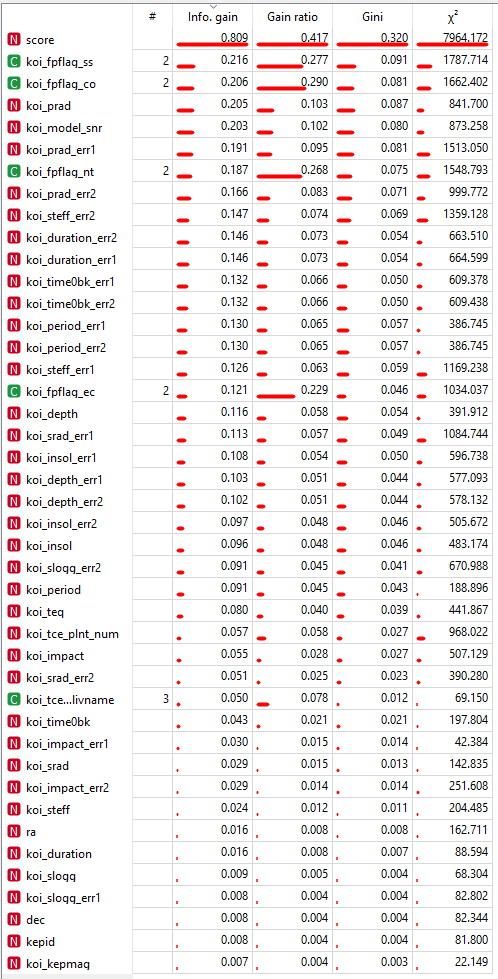
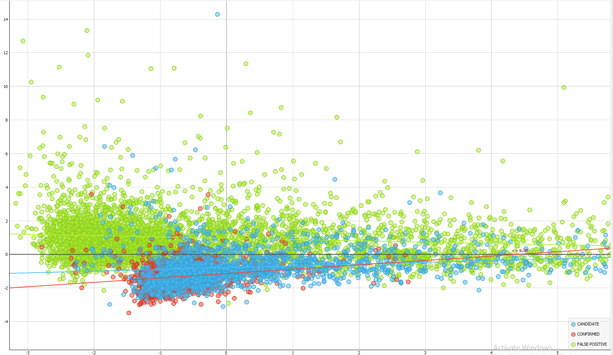
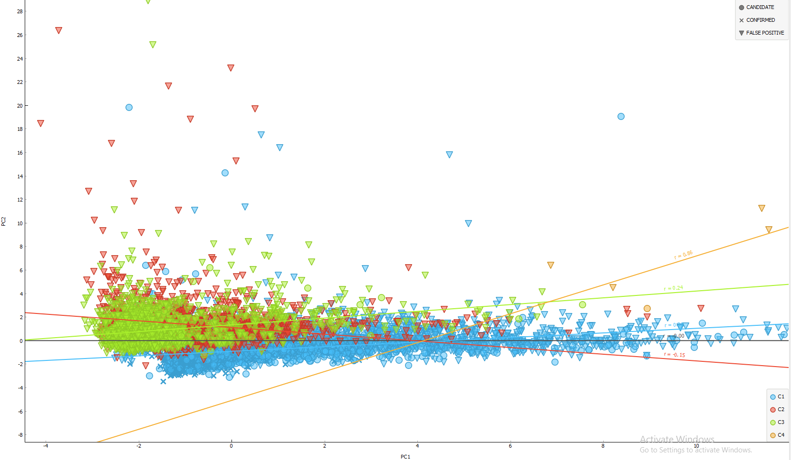

# Exoplanet detection and classification
Playing around with the Kepler exoplanet database

## 1. Motivation and plan

## 2. The data
The original data consisted of **9564 rows**, each one consisting of **48 columns**. Out of these 5 attributes were classified as meta attrbutes, as they contained information such as the row ID or the name of the discovered exoplanet. The remaining attributes are measurements taken by the **Kepler Space Telescope**, with the exception of one, that being the **koi_score** attribute. This attribute is calculated from the values of the remaining measurements. This makes the attribute incredibly interesting later on. The original data contained approximately 3.2% of missing or unknown data. The biggest contributor to this was the attribute 'kepler_name' as of course most entries were not classified as exoplanets and therefore named. The other attribute with the prevaling number of missing values was the 'koi_score' attribute. Out of the 9564 rows, 1510 had the 'score' attribute missing (15.7%). 

## 3. Imputation and evaluation
Before continuing with the prediction models, missing values had to be resolved. Firstly two columns were dropped alltogether; 'koi_teq_err1' and 'koi_teq_err2' as they contained 100% missing values. Secondly, all of the features were ranked according to their Information gain, gain ratio and Gini index. The 'score' attribute proved to be the most important one in the classification of the data points, which was only confirmed by the decision tree 'test'. Therefore the 'score' attribute was selected for a more careful imputation, the remaining missing attributes (accounting for approximately 1% of all missing values) were to be replaced with the mean of that attribute.

 

The data was split into 2 sets, one containing 8054 rows with the score attribute present, and the remaining 1510 with the attribute missing. Two models were chosen for imputation **a linear regression (LR)** one and a **random forest (RF)**. Both were trained and evaluated on the bigger, complete set. The range of all possible score values lies on the [0,1] interval. Both models were evaluated resulting in the following accuracy values.

|                   | MSE   | RMSE  | MAE   | R2    |
|-------------------|-------|-------|-------|-------|
| Random Forest     | 0.777 | 0.882 | 0.066 | 0.364 |
| Linear Regression | 0.043 | 0.207 | 0.152 | 0.966 |                                                                      

### 3.1 Linear regression
The regularization selected was Lasso (L1) regularization, with a very small Lambda parameter (1e-4).
### TODO: dodaj graf natančnosti morda?

The model performed very well, resulting in very small MSE and RMSE values, both showing that the errors that occured during predicting were very equal in their magnitude, meaning we had no clear outliers (as far as predicted values go). The model, however, struggled with the MAE parameter, as it's value means that, on avreage, our prediction was off by 15% of the parameter's value.
### 3.2 Random forest
The random forest model was initialised as a group of 100 trees, with no depth limitations.

In comparison to the LR model before, the RF performed much better in regards to the avreage error (MAE), it accounting for approximately 6% of the parameter's value. However a low avreage error still does not assure the accuracy of the model. We can see that the MSE nad RMSE are much higher compared to the LR model, exposing the fact, that in this occasion there are more outliers, or these outliers are of a much higher magnitude than the ones seen in the LR model. The R2 is also much lower. 

## 4. Plotting and clustering
After the missing data has been taken care of it was time to begin plotting it in order to see, whether certain clusters would appear, thus making in much more likely to be able to build a prediction model. Ideally we'd like three clusters; one containing only 'FALSE POSITIVES', one 'CONFIRMED' and the remaining one 'CANDIDATES'.

### 4.1 Scatter Plot
Taking into account the fact, that each row has 48 features, I first had to decide on some sort of **dimensionality reduction**, as plotting 48 dimensions is simply not possible. The method I selected was **PCA (Principal Component Analysis)**. Using it I plotted all of the datapoints in respect to their first (X axis) and second (Y axis) principal component. 

 
The green dots represent exoplanets that were labelled as 'False Positive', whilst the red and blue respecitevly represent rows, which were either confirmed to be exoplanets or only candidates (not yet confirmed). Even though there is no clean separation, a red-blue cluster appears in the centre of the plot. This suggests that some sort of classification may be possible as there appears to be a difference at least between the false positive cases and our confirmed/candidates. Since PCA, in layman's terms, not only reduces the number of features, it also plots the datapoints in a way, that highlights their similarity, i.e. the closer two points are on the plot, the more similar they are to each other, further reinforcing the idea that classification is possible.

### 4.2 Clustering
The next step was trying to perform a basic classification alogirthm over our data. The first method that was used was the **k-means** clustering algorithm. It provided the following results.
 

Because I used the same data as before (after undergoing PCA) the scatter plot looks very similar. The only differences are the four colours; each representing one of the four clusters the algorithm found. Because of the big number of plotted datapoints it will be easier to review the findings in a table format.

| % of      | Total members | Confirmed | Candidate | False positive | Colour |
|-----------|---------------|-----------|-----------|----------------|--------|
| Cluster 1 | 5825          | 38.80%    | 37.36%    | 23.85%         | Blue   |
| Cluster 2 | 2045          | 0.34%     | 0.0%      | 99.66%         | Red    |
| Cluster 3 | 1686          | 1.54%     | 4.21%     | 94.25%         | Green  |
| Cluster 4 | 8             | 0.0%      | 12.5%     | 87.5%          | Orange |

Looking at the table we can quickly see, that the members of the 'False positive' category are the most distinguishable the others; seeing as two clusters consist of approximately 95% of false positive cases. It is also revealed, that the 'Candidate' and 'Confirmed' group are very similar to each other, which would make sense, as the 'Candidate' group is a collection of promising data points, where we have not yet been able to confirm whether or not these actually are planets. Only the 23.85% rate of 'False positive' datapoints in Cluster 1 introduces a bit of uncertainty into our model, as it appears a few 'False positive' datapoints are remarkably similar to our 'Confirmed' or 'Candidate' datapoints.
## Exoplanet Classification

### TODO: GRAPH EVERYTHING, to bo pa treba kar v python..

## Acknowledgements
Open source NASA Kepler Space Telescope data acquired at https://www.kaggle.com/nasa/kepler-exoplanet-search-results

Digital object identifier: DOI 10.26133/NEA4
