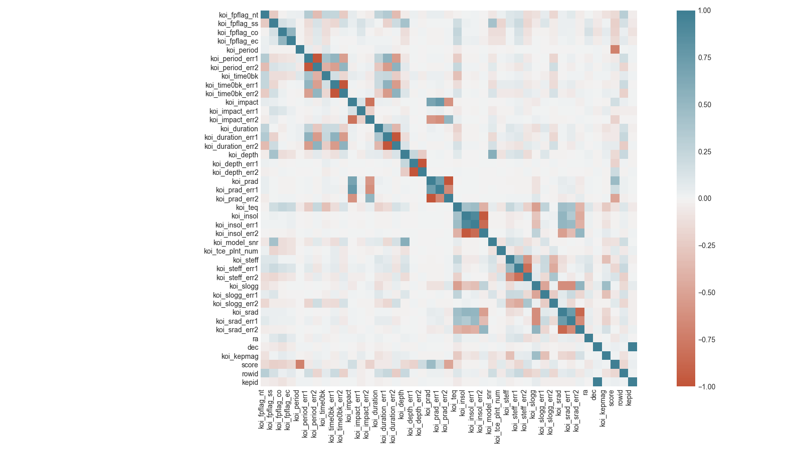
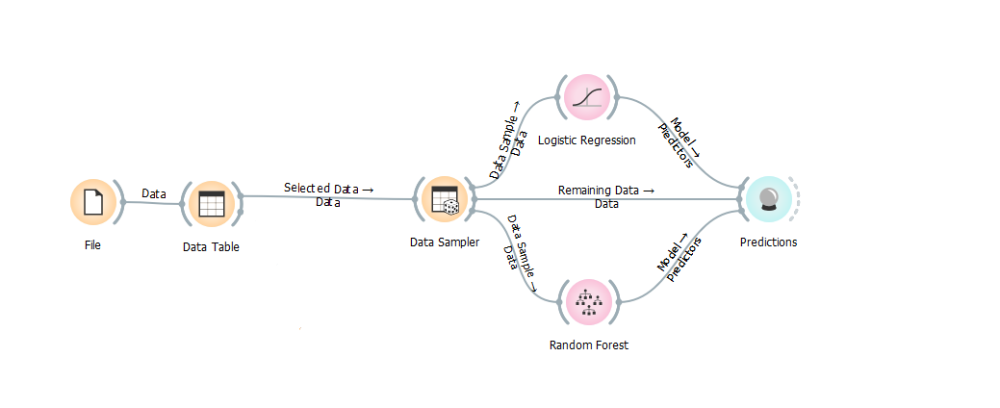
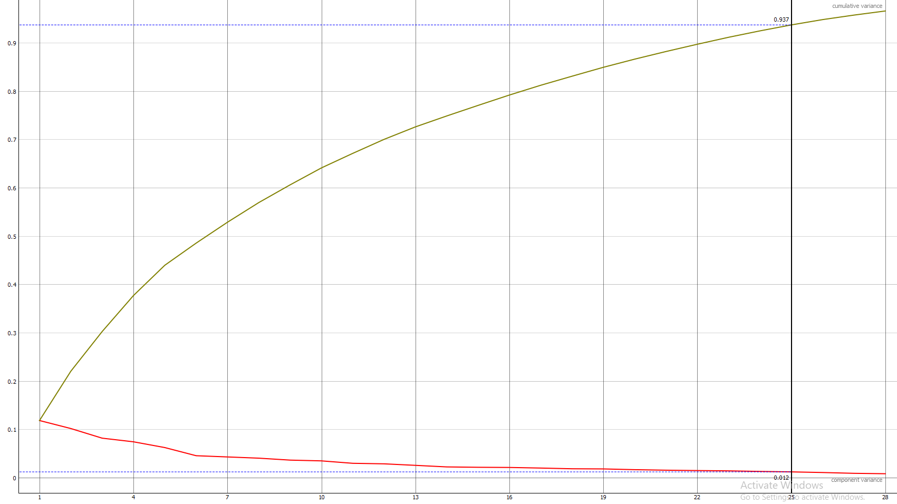

# Exoplanet detection and classification
Playing around with the Kepler exoplanet database

## 1. Plan
The objective of this small project is to analyise the Kepler Exoplanet Database dataset, in hopes of being able to build a relatively accurate prediction model to aid us in the detection of new possible exoplanet candidates. The raw data will firstly be analyised for any possible multicollinearity issues, ranked in respect to it's importance, then imputed and prepared for the building of prediction models. After this the models will be evaluated and compared.

The software used in this project will be the **Orange Data Mining platform**, where all the prediction (and clustering) models will be built and tested. All of the data will be prepared, analysied and plotted using **Python** and its **matplotlib and seaborn** libraries.

## 2. The data
The original data consisted of **9564 rows**, each one consisting of **48 columns**. Out of these 5 attributes were classified as meta attrbutes, as they contained information such as the row ID or the name of the discovered exoplanet. The remaining attributes are measurements taken by the **Kepler Space Telescope**, with the exception of one, that being the **koi_score** attribute. This attribute is calculated from the values of the remaining measurements. This makes the attribute incredibly interesting later on. The original data contained approximately 3.2% of missing or unknown data. The biggest contributor to this was the attribute 'kepler_name' as of course most entries were not classified as exoplanets and therefore not named. The other attribute with the prevaling number of missing values was the 'koi_score' attribute. Out of the 9564 rows, 1510 had the 'score' attribute missing (15.7%). 

The exoplanetarchive website provides explanations of all of the features present in our Kepler Object of Interest table [https://exoplanetarchive.ipac.caltech.edu/docs/API_kepcandidate_columns.html]

The **'koi_score'** feature, which will prove to be one of the most important ones is defined as:
A value between 0 and 1 that indicates the confidence in the KOI disposition. For CANDIDATEs, a higher value indicates more confidence in its disposition, while for FALSE POSITIVEs, a higher value indicates less confidence in that disposition. 

## 3. Imputation and evaluation
Before continuing with the prediction models, missing values had to be resolved. Firstly two columns were dropped alltogether; 'koi_teq_err1' and 'koi_teq_err2' as they contained 100% missing values. Secondly, all of the features were ranked according to their **Information gain, gain ratio and Gini index**. Supplementing this ranking, several **decision trees** were constructed, which only confirmed the original ranking. The **'koi_score'** attribute proved to be the most important one in the classification of the data points, which was only confirmed by the decision trees. Therefore the 'score' attribute was selected for a more careful imputation, the remaining missing attributes (accounting for approximately 1% of all missing values) were to be replaced with **the mean** of that column.

 

The data was split into 2 sets, one containing 8054 rows with the score attribute present, and the remaining 1510 with the attribute missing. Two models were chosen for imputation **a Linear Regression (LR)** one and a **Random Forest (RF)**. Both were trained and evaluated on the bigger, complete set. The range of all possible score values lies on the **[0,1] interval**. Both models were evaluated resulting in the following accuracy values.

|                   | MSE   | RMSE  | MAE   | R2    |
|-------------------|-------|-------|-------|-------|
| Random Forest     | 0.777 | 0.882 | 0.066 | 0.364 |
| Linear Regression | 0.043 | 0.207 | 0.152 | 0.966 |   

After this evaluation, both models were run on the smaller (1510 rows) dataset in order to predict (impute) the missing score values.

### 3.1 Correlations
 
After computing the correlation matrix from the imputed data, we can see that not many features have strong correlations; most being close to, or exactly zero. Strong correlations are only seen in 'related features' i.e. features measuring uncertainties (_err1 and _err2 features.) These are  1-σ uncertainties, and as such the correlation between these will always be high. Outside of those the small correlations do not suggest any potential multicollinearity problems. Such problems would not necessarily affect the accuracy of the model, but the weights (importances) of certain features. This problem was resolved by using two different methods of ranking. The decision tree was especially useful, as more than one could be constructed ensuring any possible artifacts regarding the previously mentioned feature weights would not cause innacuracies.

### 3.2 Linear regression
The regularization selected was Lasso (L1) regularization, with a small Lambda parameter (1e-4).

The model performed well, resulting in very small MSE and RMSE values, both showing that the errors that occured during predicting were very equal in their magnitude, meaning we had no clear outliers (as far as predicted values go). The model, however, struggled with the MAE parameter, as it's value means that, on avreage, our prediction was off by 15% of the parameter's value, which was higher than the 10% upper limit I was targeting.
### 3.3 Random forest
The random forest model was initialised as a set of 100 trees, with no depth limitations.

In comparison to the LR model before, the RF performed much better in regards to the avreage error (MAE), it accounting for approximately 6% of the parameter's value. However a low avreage error still does not assure the accuracy of the model. We can see that the MSE nad RMSE are much higher compared to the LR model, exposing the fact, that in this occasion there are more outliers, or these outliers are of a much higher magnitude than the ones seen in the LR model. The R2 is also much lower. 

Seeing as none of the models emerged as the clearly better option, both predictions (imputations) were kept, and will be evaluated again, later on, in the classification phase of the project.

## 4. Plotting and clustering
After the missing data has been taken care of it was time to begin plotting it in order to see, whether certain clusters would appear, thus making in much more likely to be able to build a prediction model. Ideally we'd like three clusters; one containing only 'FALSE POSITIVES', one 'CONFIRMED' and the remaining one 'CANDIDATES'.

### 4.1 Scatter Plot
Taking into account the fact, that each row has 48 features, I first had to decide on some sort of **dimensionality reduction**, as plotting 48 dimensions is simply not possible. The method I selected was **PCA (Principal Component Analysis)**. Using it I plotted all of the datapoints in respect to their first (X axis) and second (Y axis) principal component. 

 
The green dots represent exoplanets that were labelled as 'False Positive', whilst the red and blue respecitevly represent rows, which were either confirmed to be exoplanets or only candidates (not yet confirmed). Even though there is no clean separation, a red-blue cluster appears in the centre of the plot. This suggests that some sort of classification may be possible as there appears to be a difference at least between the false positive cases and our confirmed/candidate cases. Since PCA, in layman's terms, not only reduces the number of features, it also plots the datapoints in a new coordinate system, that highlights their similarity, i.e. the closer two points are on the plot, the more similar they are to each other, further reinforcing the idea that classification is possible.

### 4.2 Clustering
The next step was trying to perform a basic classification alogirthm over our data. The first method that was used was the **k-means clustering algorithm**. It provided the following results.
 

Because I used the same data as before (after undergoing PCA) the scatter plot looks very similar. The only differences are the four colours; each representing one of the four clusters the algorithm identified. Because of the big number of plotted datapoints it will be easier to review the findings in a table format.

| % of      | Total members | Confirmed | Candidate | False positive | Colour |
|-----------|---------------|-----------|-----------|----------------|--------|
| Cluster 1 | 5825          | 38.80%    | 37.36%    | 23.85%         | Blue   |
| Cluster 2 | 2045          | 0.34%     | 0.0%      | 99.66%         | Red    |
| Cluster 3 | 1686          | 1.54%     | 4.21%     | 94.25%         | Green  |
| Cluster 4 | 8             | 0.0%      | 12.5%     | 87.5%          | Orange |

Looking at the table we can see that the members of the 'False positive' category are the most distinguishable from the rest; seeing as two clusters consist of approximately 95% of false positive cases. It is also revealed, that the 'Candidate' and 'Confirmed' group are very similar to each other, which would make sense, as the 'Candidate' group is a collection of promising data points, where we have not yet been able to confirm whether or not these actually are planets. Only the 23.85% rate of 'False positive' datapoints in Cluster 1 introduces a bit of uncertainty into our model, as it appears a few 'False positive' datapoints are remarkably similar to our 'Confirmed' or 'Candidate' datapoints.

## 5. Building and evaluating the prediction models
As before the prediction models chosen are the **Logistic Regression (LR)** and the **Random Forest (RF)**. Both models were evaluated using the data imputed from section 3. Each model was evaluated on the data imputed with the Logistic Regression and Random Forest models. Additionaly the Logistic Regression model was run on the imputed dataset after undergoing **PCA** in order to determine, whether dimensionality reduction would be a viable option, and to determine any possible negative impacts of smaller variance.

 

### 5.1 Logistic Regression
The data was sampled before being sent into the prediction model. 60% of the data was used as the training dataset, whereas the remaining 40% were used as the testing dataset. L1 (Lasso) regression was once again used, along with the C parameter of 14.

|                 | AUC   | CA    | F1    | Precision | Recall |
|-----------------|-------|-------|-------|-----------|--------|
| LR Imputed Data | 0.970 | 0.886 | 0.886 | 0.887     | 0.886  |
| RF Imputed Data | 0.967 | 0.878 | 0.876 | 0.882     | 0.878  |

### 5.2 Random Forest
Just as with the Logistic regression before, the same process was used, only substituting the Logistic Regression model with the Random Forest one.

|                 | AUC   | CA    | F1    | Precision | Recall |
|-----------------|-------|-------|-------|-----------|--------|
| LR Imputed Data | 0.977 | 0.904 | 0.904 | 0.904     | 0.904  |
| RF Imputed Data | 0.977 | 0.903 | 0.902 | 0.902     | 0.903  |

### 5.3 Principal Component Regression (PCR)
As before, the same data was used. This time, however, the data underwent PCA, after which the 25 first principal components (PCs) were kept, accounting for 93.7% of our original variance, whilst also accounting for only 58% of the original number of features.
Below is a graph showing the relationship between the number of features and percentage of variance kept (27 PCs represent 95% of the total variance).
 

The following scores were obtained,

|                      | AUC   | CA    | F1    | Precision | Recall |
|----------------------|-------|-------|-------|-----------|--------|
| Logistic Regression  | 0.975 | 0.900 | 0.899 | 0.901     | 0.900  |
| Random Forest        | 0.974 | 0.898 | 0.898 | 0.897     | 0.898  |

### 5.4 Evaluation
Even though the scores listed above can not evaluate how good a model is on their own, they can certainly give us at least an idea. More importantly, we can use them to objectively **compare** our models to determine which one is better suited for our current task. All 3 models came remarkably close to one another, all three separated by approximately 1% (in regards to the values of the scoring parameters, as well as the classification accuracy). We can see that by all metrics, the Logistic Regression scores lower values across the board than the two other models; including the PCR one. All three models used the same data (except for the PCR model, that one used the same data after undergoing PCA) and all models had the exact same parameters. 

The Random Forest model performed very well, achieving an AUC score of 0.977, classifying it as an excellent classifier. A CA of 0.904 also indicates a relatively accurate model, correctly predicting more than 90% of it's input data. Two important metrics here were also the **Precision and Recall values**. The precision parameter measures the percentage of positive (confirmed) datapoints classified correctly, while recall measures the total number of positive instances identified. A high **F1 score** confirms, that the classification accuracy is not boosted by a huge number of correctly identified negative instances. Due to the nature of our problem this is very important, as we are mostly interested in identifying and classifying the positive instances (i.e. the actual exoplanets). This leads me to believe, that the RF model (in conjucntion with the RF imputation) is best suited for the problem at hand.

The most exciting predictor, at least in my opinion, was definetly the Principal Component Regression, as it managed to improve on the Logistic Regression model, whilst, at the same time, using approximately half the amount of the data we started with. Precision and Recall values of 0.9> also suggest the usability of such an approach. Working with a small dataset such as this did not yield any noticable performance (especially memory related) improvements. It does however give us something to think about when working with bigger datasets.

## Acknowledgements
Open source NASA Kepler Space Telescope data acquired at https://www.kaggle.com/nasa/kepler-exoplanet-search-results

Digital object identifier: DOI 10.26133/NEA4
